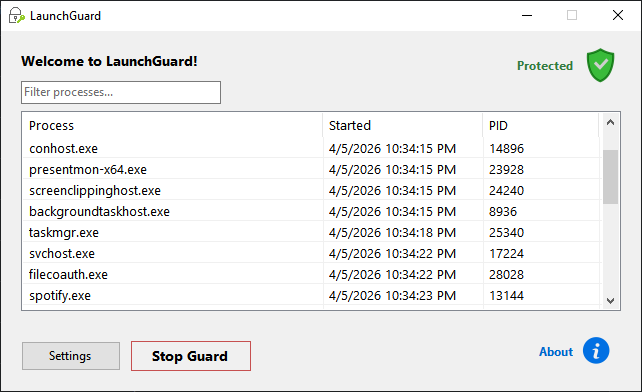

<h1>
   LaunchGuard - App Locker for Windows
</h1>

A free, open-source Windows utility that blocks selected applications behind custom authentication.

---

## Motivation

Every existing app locker for Windows I could find is either paywalled ($20–$30+), poorly maintained, or both. They're simple background utilities — there's no justification for that price. LaunchGuard exists to fill that gap: a clean, free, and open alternative that anyone can use, inspect, and contribute to.

---

## How It Works

1. Add any executable to the protected list via the UI.
2. LaunchGuard monitors process creation in the background using WMI event subscriptions.
3. When a protected app is launched, it is immediately terminated and an authentication prompt appears.
4. If the correct credentials are provided, the app relaunches. Otherwise it stays blocked.
5. No modifications are made to the original executables.

Protection is configured per-app. You can add or remove apps, toggle protection on/off, and manage credentials entirely from the UI.

---

## Features

- Block any `.exe` behind a credential prompt
- WMI-based process monitoring — no polling, low resource usage
- Process tree termination — child processes don't escape
- UWP / Microsoft Store app support via URI relaunch
- Startup persistence via Windows registry
- DACL-based process protection to raise the cost of killing LaunchGuard
- Tray icon with stealth/rename option
- JSON-based config — human-readable, no registry bloat
- Clean WinForms UI with a developer/sysadmin aesthetic

---

## Threat Model

LaunchGuard is designed to block casual and opportunistic access to protected apps. It is **not** designed to be unstoppable against a determined local administrator.

Specifically:
- A user with admin rights can stop the process or disable protection with enough effort.
- The DACL protection raises the friction for this, but does not make it impossible.
- WMI event delivery has inherent latency — there is a small window between process creation and enforcement where a fast-starting process may briefly execute.

If you need enforcement that resists a local admin, supplement with Windows Defender Application Control (WDAC) or AppLocker. LaunchGuard is not a replacement for those tools.

---

## Tech Stack

- **Language:** C#
- **UI:** WinForms (.NET)
- **Process monitoring:** WMI event subscriptions
- **Config:** Local JSON
- **Protection:** DACL via P/Invoke, process tree termination, Windows Credential prompt

---

## Requirements

- Windows 10 or Windows 11
- .NET 6.0 or later
- Administrator rights (required for DACL protection and registry persistence)

---

## Roadmap

**v2 — Service architecture**
The main planned evolution is a split into a Windows Service (always-on enforcement) and a WinForms control panel (configuration only). This will make protection survive UI process termination and persist more robustly across sessions. That work is tracked separately and will ship as v2.

---

## Contributing

Issues and PRs are welcome. If you're reporting a bug, include your Windows version and what app you were trying to protect.

---

*Built to offer a simpler, more accessible alternative to overpriced app lockers.*
